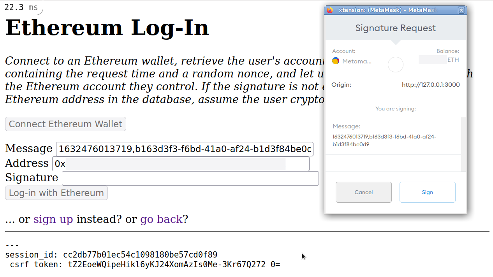

# README

Ethereum on Rails MVP: allow sign-up and log-in with Ethereum wallet (e.g., MetaMask browser extension).

[](https://github.com/auchenberg/volkswagen)
[](https://hits.seeyoufarm.com)
[](https://github.com/q9f/ethereum-on-rails/pulse)
[](LICENSE)

:heavy_check_mark: If you are here to **learn Ethereum-account authentication**, _welcome!_ Feel free to read the following article that is based on this code:
* [Finally authenticating Rails users with MetaMask](https://dev.to/q9/finally-authenticating-rails-users-with-metamask-3fj)

:warning: If you are here to **build Sign-in with Ethereum for production**, you should use the SIWE libraries instead:
* [Sign-In with Ethereum - Ruby Library and Rails Examples Release](https://blog.spruceid.com/sign-in-with-ethereum-ruby-library-release-and-rails-examples/)



### Required versions

* Ruby `^3.0.0`
* Rails `^7.0.0`
* Node `^17.4.0`

### System dependencies

* Ruby, Gems, Rails, SQLite3, Bundler, NodeJS, NPM, Yarn

```bash
pacman -S ruby rubygems sqlite nvm
nvm install stable
npm install --global npm yarn
gem install bundler rails
```

### Run dev server

```bash
nvm use stable
bundle install
bin/rails webpacker:install
bin/rails db:migrate
bin/rails server
```

### How it works

##### Model: `User`

The user contains three attributes: `username`, `eth_address`, `eth_nonce`.
- The Name provides a pretty identity.
- The Address is the unique identifier used for authentiation.
- The Nonce is a random `UUID` that has to be signed for authentiation.

In this MVP, all three fields are mandatory and have to be unique.

##### Controller: `Users{#new,#create}`

The users controller is solely used for creating new users.
- It generates an initial random nonce with `SecureRandom.uuid`.
- It ensures the user picks a name.
- It takes the `eth_address` from the sign-up view (see below).
- It ensures the `eth_address` is a valid Ethereum address.
- It creates a new user and saves it to the database with the given attributes.

##### View: `Users#new`

The `Users#new` view is the sign-up page to create a new account.
- It contains a field for the user to choose a name.
- It contains a read-only, hidden field that will be populated with the user's Ethereum address.
- It contains a `Connect` button to establish a connection with the Ethereum provider.

The JavaScript pack `users_new.js` contains the frontend logic to establish a connection with an Ethereum wallet.
- It hides read-only fields.
- It ensures an Ethereum context is available.
- It adds an click-event listener to the connect button.
- It requests accounts from the available Ethereum wallet: `method: 'eth_requestAccounts'`
- It adds the `eth_address` to the form and submits it.

##### Controller: `Sessions{#new,#create,#destroy}`

The sessions controller manages the user authentication (login/logout).
- It finds the user by `eth_address` provided by Ethereum wallet.
- It ensures user exists in database.
- It ensures user signed a message to authenticate.
- It ensures the signature is not expired (older than 5 minutes).
- It ensures the signed nonce matches with our database.
- It recovers the pubkey and address from the signature.
- It ensures the recovered address matches the address in the database.
- It logs the user in if all the above is true.
- If generates a new nonce for future logins if all of the above is true.

It also handles destroying sessions to log users out.

The JavaScript pack `sessions_new.js` contains the frontend logic to authenticate a user with an Ethereum account.
- It hides all the read-only fields.
- It ensures an Ethereum context is available.
- It adds a click-event listener to the connect button.
- It requests accounts from the available Ethereum wallet: `method: 'eth_requestAccounts'`
- It requests the nonce belonging to the account from the API/v1 (see below): `fetch("/api/v1/users/" + account)`
- It generates a message containing the site's title, the request time, and the nonce from the API.
- It requests the user to sign the message: `method: 'personal_sign', params: [ message, account ]`
- It populates the form with address, message, and signature and submits it.

##### API: `/api/v1/users{#index,#show}`

To prevent signature spoofing, the user needs to sign a specific piece of information we can verify in the backend rather than a random message. The `User` model contains an `eth_nonce` field that gets filled with a random UUID on first sign-up and gets rotated on every successful login.

The `#index` controller explicitly returns `nil` to prevent accessing the full set of users from the database.
- GET `/api/v1/users`, returns `null`

The `#show` controller gets a user by `eth_address` from the database and returns the `eth_nonce` or `nil` if it does not exist.
- GET `/api/v1/users/${eth_account}`
- It ensures the `eth_account` parameter is a valid Ethereum address to filter out seemingly random requests.
- It finds a user in database by `eth_account` key.
- It returns _only_ the `eth_nonce` as JSON.
- It returns `null` if it fails in any step above.

### Credits

The Ethereum-on-Rails template was written by [@q9f](https://github.com/q9f) can be found and used on Github directly: [github/q9f/ethereum-on-rails](https://github.com/q9f/ethereum-on-rails/)

This Rails application template implements the logic described by Amaury Martiny in [One-click Login with Blockchain: A MetaMask Tutorial](https://www.toptal.com/ethereum/one-click-login-flows-a-metamask-tutorial) - brilliant, though slightly outdated, resource! Thanks for that.
